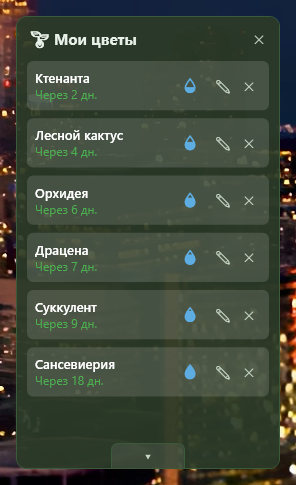
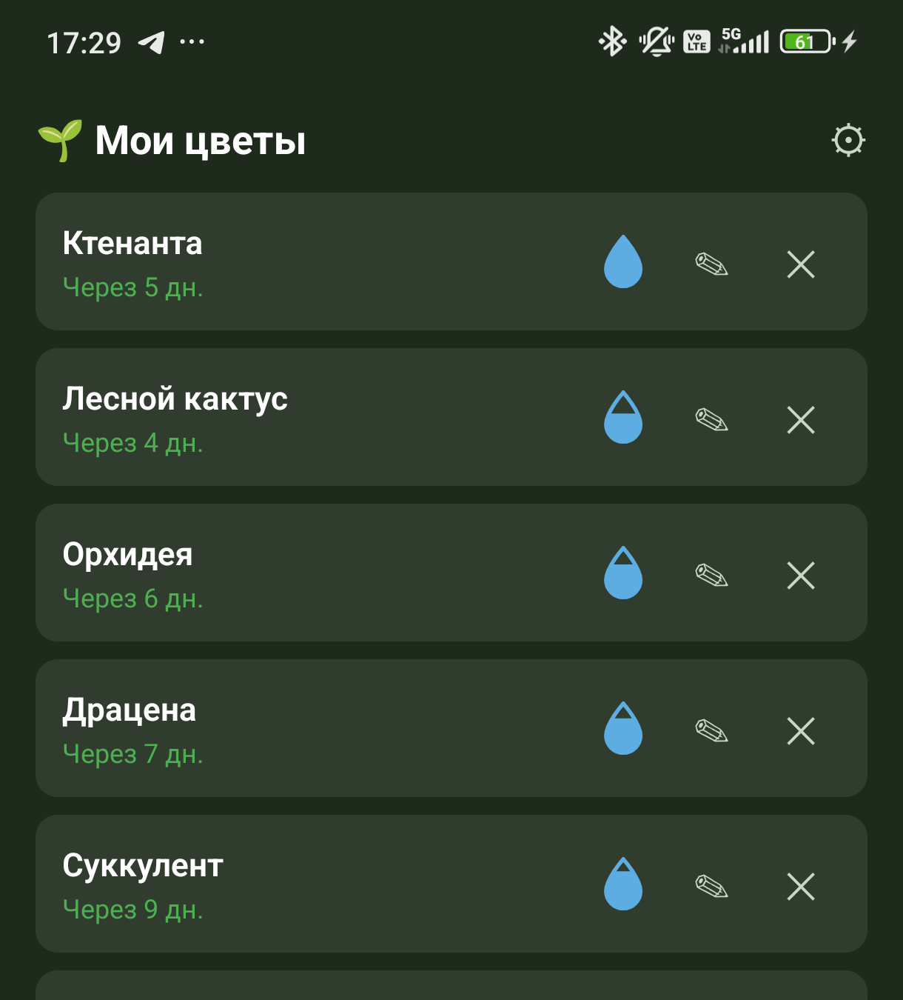

# Plant Alarm

**[English](README.en.md) | Русский**

Маленький Windows-виджет и Android-приложение для напоминаний о поливе комнатных растений — с синхронизацией между телефоном и десктопом по локальной сети.

**[→ Сайт проекта](https://labaks.github.io/PlantAlarm/)**

  
  &nbsp;&nbsp;&nbsp;
  

## Что это

Plant Alarm — два отдельных, но совместимых приложения:

- **Десктоп-виджет** (WPF, .NET 7) — всегда на виду, прилипает поверх окон, показывает список растений и капли-индикаторы, когда пора поливать.
- **Мобильное приложение** (React Native / Expo, Android) — то же самое в кармане, с push-уведомлениями.

Оба хранят данные независимо, но могут синхронизироваться друг с другом по локальной Wi-Fi сети — без облака и аккаунтов.

## Возможности

- Индивидуальный интервал полива для каждого растения; капля показывает, сколько «воды» осталось до следующего полива, и постепенно пустеет к сроку.
- Кнопка «Полить» работает в любой момент — если поливаете раньше срока, приложение переспросит.
- Дату последнего полива можно поправить и при добавлении растения, и позже в редактировании.
- Push-уведомления на телефоне, когда пора поливать.
- Временная синхронизация телефон ↔ десктоп по локальной сети (двустороннее слияние изменений, включая удаления).
- Интерфейс на русском и английском (переключается в настройках, без перезапуска).

Полный список изменений — в [CHANGELOG.md](CHANGELOG.md), план развития — в [TODO.md](TODO.md).

## Скачать

Готовые сборки — на странице **[Releases](https://github.com/labaks/PlantAlarm/releases)**:

- Десктоп (Windows) — `.exe`, .NET на компьютере не нужен.
- Мобильное (Android) — `.apk`.

## Технологии

- Десктоп: C#, WPF, .NET 7
- Мобильное: React Native, Expo, TypeScript
- Синхронизация: HTTP-сервер на десктопе + периодический опрос с телефона по локальной сети
